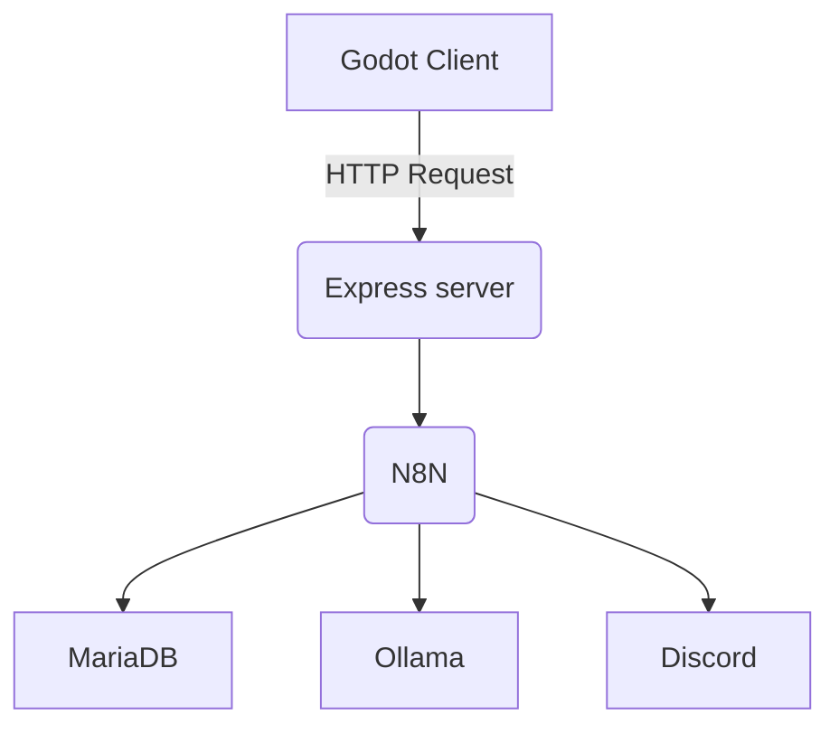

# HWG Bug Report Tool
A self-hosted bug report and review pipeline for Godot Projects

This system allows playtesters to submit bug reports directly from the game, including a screenshot and contextual information from the game/world state. Reports are processed by a backend service and forwarded through an automated workflow for review and notification.

## Architecture 

## Features
- Submit bug reports directly from Godot
- Automatically capture and attach screenshots
- Allows systems throughout the game to register a callback for debug information to send relevant data, such as the input buffer, player state, inventory, network lobby info, world state, etc.
- Automatically processes reports with an N8N workflow
- Uses a local model running in Ollama to generate a summary of the report
- Sends notifications and a link to the report to Discord
- Web-based report viewing through server-side rendered JSX templates

## Why I Built It
This tool initially started as a way to gather feedback from playtesters about what values felt right when they were using the [Command Console](https://github.com/Half-Way-Games/GodotCommandConsole) to tweak player movement variables. The changed values would be sent to the reporter to be used as the payload on submission. From there, it grew into a bug reporting tool that playtesters could use to capture and document bugs they encountered in the game and the values they had set at the time to make it easier to track down the cause.

> [!NOTE]
> This repo contains the implementation and configuration used for my personal development environment. It is primarily intended as a reference rather than a plug-and-play application. It does not contain any of the N8N workflows, just the Godot part of the tool and the backend service (report ingestion and the report viewer). If you would like to know more, you can read the write-up for it on my website. [Bug Report Tool](https://jakepigg.com/projects/bug-report-tool)
